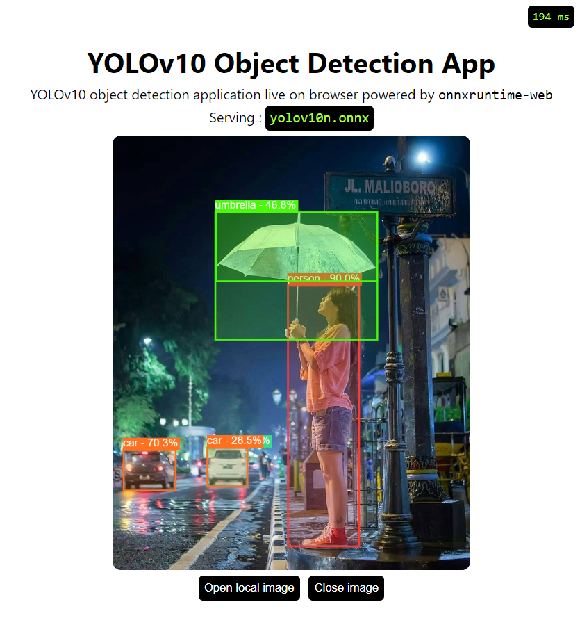

# YOLOv10 with onnxruntime-web

<p align="center">
  
</p>


---

Object Detection application right in your browser.
Serving YOLOv10 in browser using onnxruntime-web with `wasm` backend.

## Setup

```bash
git clone https://github.com/Hyuto/yolov10-onnxruntime-web.git
cd yolov10-onnxruntime-web
yarn # Install dependencies
```

## Scripts

```bash
yarn start # Start dev server
yarn build # Build for productions
```

## Models

**Main Model**

YOLOv10n model converted to onnx.

```
used model : yolov10n.onnx
size       : 8.95 MB
```

**Preprocessing**

ONNX model to perform image preprocessing [CUSTOM].

[](https://netron.app/?url=https://raw.githubusercontent.com/Hyuto/yolov10-onnxruntime-web/master/public/model/preprocess-yolo.onnx)

## Use another model

> :warning: **Size Overload** : used YOLOv10n model in this repo is the smallest with size of 8.95 MB, so other models is definitely bigger than this which can cause memory problems on browser.

Use another YOLOv10 model.

1. Export YOLOv10 model to onnx format. Read more on the [official documentation](https://github.com/THU-MIG/yolov10?tab=readme-ov-file#export)
2. Copy `yolov10*.onnx` to `./public/model`
3. Update `modelName` in `App.jsx` to new model name
   ```jsx
   ...
   // configs
   const modelName = "yolov10*.onnx"; // change to new model name
   const modelInputShape = [1, 3, 640, 640];
   const scoreThreshold = 0.2;
   ...
   ```
4. Done! 😊

**Note: Custom Trained YOLOv10 Models**

Please update `src/utils/labels.json` with your custom YOLOv10 classes.

## Reference

- https://github.com/THU-MIG/yolov10
